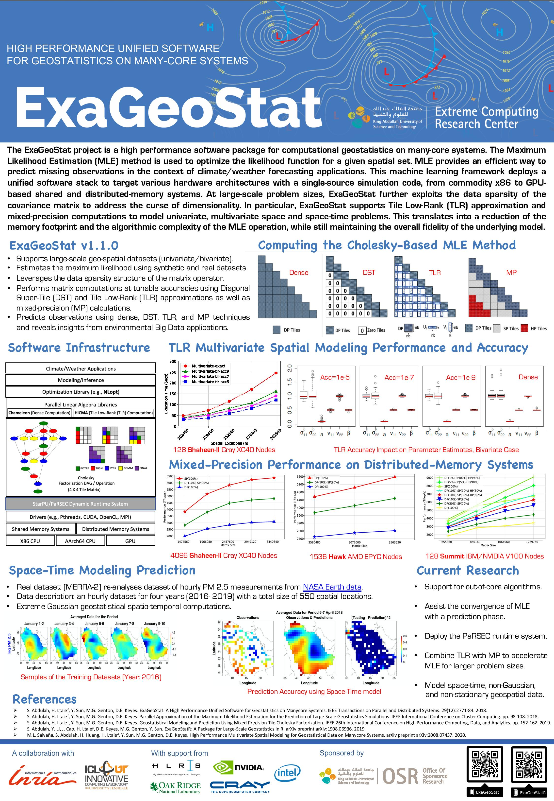

What is ExaGeoStat?
================

The **Exascale GeoStatistics** project (ExaGeoStat) is a parallel high performance unified framework for computational geostatistics on many-core systems. The project aims at optimizing the likelihood function for a given spatial data to provide an efficient way to predict missing observations in the context of climate/weather forecasting applications. This machine learning framework proposes a unified simulation code structure to target various hardware architectures, from commodity x86 to GPU accelerator-based shared and distributed-memory systems. ExaGeoStat enables statisticians to tackle computationally challenging scientific problems at large-scale, while abstracting the hardware complexity, through state-of-the-art high performance linear algebra software libraries.

Vision of ExaGeoStat
=================

ExaGeoStat is a collaboration between the KAUST Statistics group and the Extreme Computing Research
Center (ECRC). Its contribution lies not in a new algorithm nor in a new data set,
but in demonstrating the routine use of the larger data sets becoming available to geospatial
statisticians, thanks to the implementation of state-of-the-art statistical algorithms on
high-performance computing (HPC) hardware. 

We have built a standalone software framework (ExaGeoStat) that is able to run on a variety
of hardware resources, including GPUs and massive distributed systems such as Shaheen,
KAUST's Cray XC40 supercomputer, and to create a statistical model to predict environmental data
(i.e., temperature, flow rates, soil moisture, wind speed, etc.) at spatial locations on which data
is missing, and to exploit large amounts of data to reduce the effect of individual measurement
errors.  The best-known methods for such statistical processing have a cost that grows rapidly
in the size of the data set, namely, in proportion to its cube, or third power.  Thus, increasing
the size of data set by a factor ten drives up the cost of the computation by a factor of
a thousand, while simultaneously driving up the memory requirements by a factor o hundred.  

For instance, according to this cubic growth in complexity, a computation that requires one
minute would require nearly 17 hours on a data set just ten times larger. This creates a
computational strain on standard statistics software, for which contemporary data sizes
were not anticipated; and even if possible, it puts the computation beyond the interactive
attention span of the analyst. Parallelism (assigning thousands of processors to the
single task) and Moore's Law allow leading edge computers to handle such "big data" 
with ease, but the software bridge must be built.  Furthermore, the software interface
must resemble the interactive one with which working statisticians are familiar.

To summarize, the combination of emerging computing capabilities and emerging datasets
promises significant advances in statistical analyses of environmental and many other
phenomena.  Such cross-disciplinary advances are natural at KAUST, which is why this relatively low-hanging fruit was ours to harvest earliest. Our roadmap is taking ExaGeoStat 
a step further on the algorithmic side by introducing a new type of approximation
(hierarchical tile low-rank approximation) that is systematic and whose errors can
be understood and controlled, in order to further expand practical problem sizes for
even modest computational resources, since most working statisticians lack access to
systems like Shaheen.

Current Features of ExaGeoStat
======================
Operations:
1.  Large-scale synthetic matrix generation.
2.  Maximum likelihood estimation from dense covariance matrices.
3.  Predicting large-scale unknown measures in predefined geo-spatial locations.

Programming model:
1.  Task-based programming model and dynamic runtime systems using CHAMELEON and StarPU

Installation
============

Installation requires at least **CMake** of version 3.2.3. To build ExaGeoStat,
please follow these instructions:

1.  Get ExaGeoStat from git repository

        git clone git@github.com:ecrc/exageostat

    or

        git clone https://github.com/ecrc/exageostat

2.  Go into exageostat folder

        cd exageostat

3.  Get submodules

        git submodule update --init

4.  Create build directory and go there

        mkdir build && cd build

5.  Use CMake to get all the dependencies

        cmake .. -DCMAKE_INSTALL_PREFIX=/path/to/install/

6.  Build ExaGeoStat

        make -j

7.  Run tests (optional)

        make test

8.  Build local documentation (optional)

        make docs

9.  Install ExaGeoStat

        make install

10. Add line

        export PKG_CONFIG_PATH=/path/to/install:$PKG_CONFIG_PATH

    to your .bashrc file.

Now you can use pkg-config executable to collect compiler and linker flags for
ExaGeoStat.

Example
=======

Test Synthetic dataset where N=1600

  ./examples/zgen\_mle\_test  --kernel=?:?:? --test --ikernel=1:0.1:0.5 --computation=exact  --N=1600  --ncores=20 --ts=560  --olb=0.1:0.1:0.1 --oub=5:5:5

Publication
===========
Abdulah, Sameh, Hatem Ltaief, Ying Sun, Marc G. Genton, and David E. Keyes. "ExaGeoStat: A High Performance Unified Framework for Geostatistics on Manycore Systems." arXiv preprint arXiv:1708.02835 (2017). (Under Review TPDS Journal)

Handout
=======

More information can be found in this handout:

