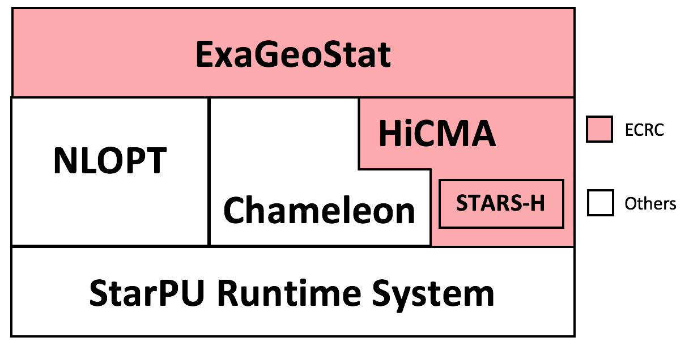

1. [Portable Hardware Locality (hwloc)](https://www.open-mpi.org/projects/hwloc/): a software package provides a portable abstraction of the hierarchical topology of modern architectures.
2. [NLopt](https://nlopt.readthedocs.io/en/latest/): a library for nonlinear optimization, providing a common interface for a number of different free optimization routines available online as well as original implementations of various other algorithms.
3. [GNU Scientific Library (GSL)](https://www.gnu.org/software/gsl/doc/html/index.html): a collection of routines for numerical computing.
4. [StarPU](http://starpu.gforge.inria.fr/): a task programming library for hybrid architectures.
5. [Chameleon](https://project.inria.fr/chameleon/): a dense linear algebra software relying on sequential task-based algorithms where sub-tasks of the overall algorithms are submitted to a runtime system.
6. [HiCMA](https://github.com/ecrc/hicma): Hierarchical Computations on Manycore Architectures library, aims to redesign existing dense linear algebra libraries to exploit the data sparsity of the matrix operator.
7. [STARS-H](https://github.com/ecrc/stars-h): a High performance parallel open-source package of Software for Testing Accuracy, Reliability and Scalability of Hierarchical computations.

